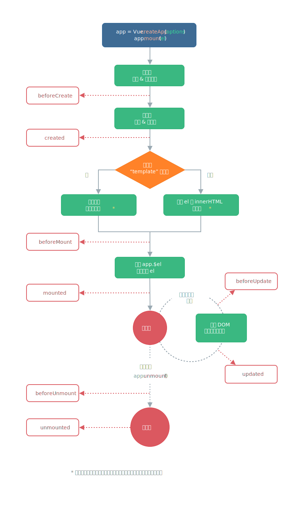

<!--
 * @Author: tangdaoyong
 * @Date: 2021-06-26 16:22:49
 * @LastEditors: tangdaoyong
 * @LastEditTime: 2021-06-26 16:28:12
 * @Description: Vue组件生命周期
-->
# Vue组件生命周期

[Vue组件生命周期](https://v3.cn.vuejs.org/guide/instance.html#%E7%94%9F%E5%91%BD%E5%91%A8%E6%9C%9F%E5%9B%BE%E7%A4%BA)

## 介绍



```ts
import { defineComponent } from 'vue'

export default defineComponent({
  name: 'App',
  beforeCreate() {

  },
  created() {

  },
  beforeMount() {

  },
  mounted() {

  },
  beforeUpdate() {

  },
  updated() {

  },
  beforeUnmount() {

  },
  unmounted() {
    
  }
})
```