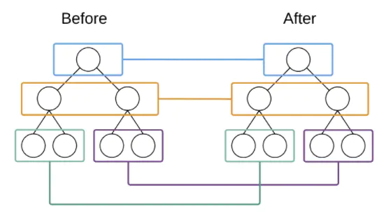
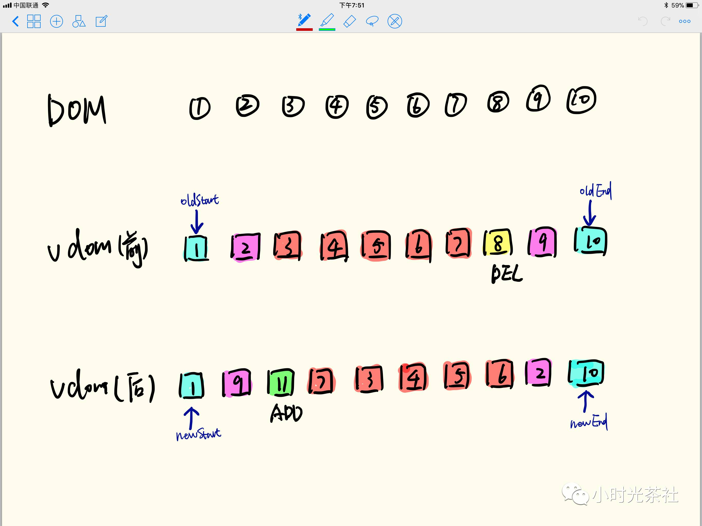
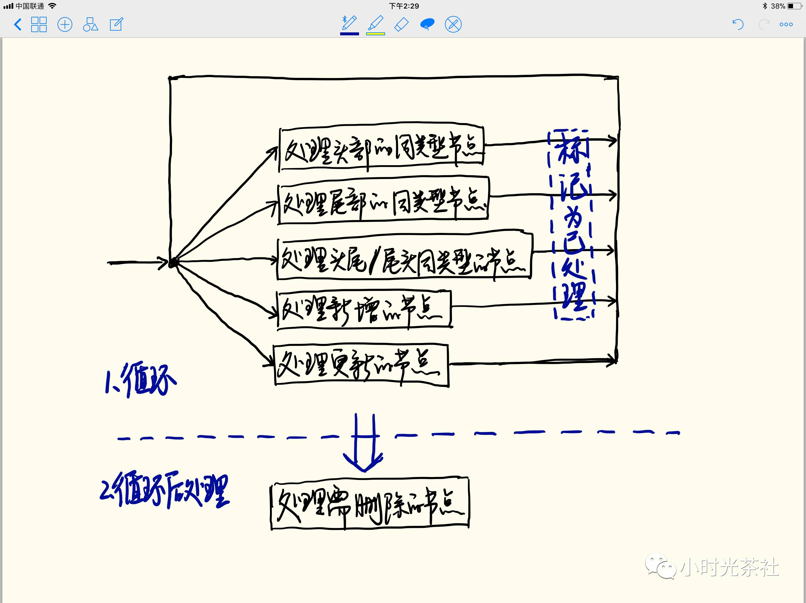
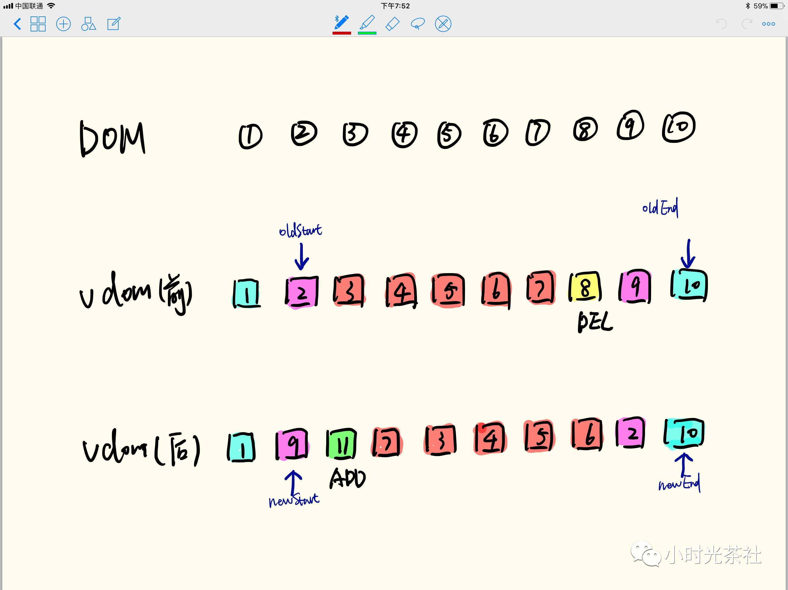
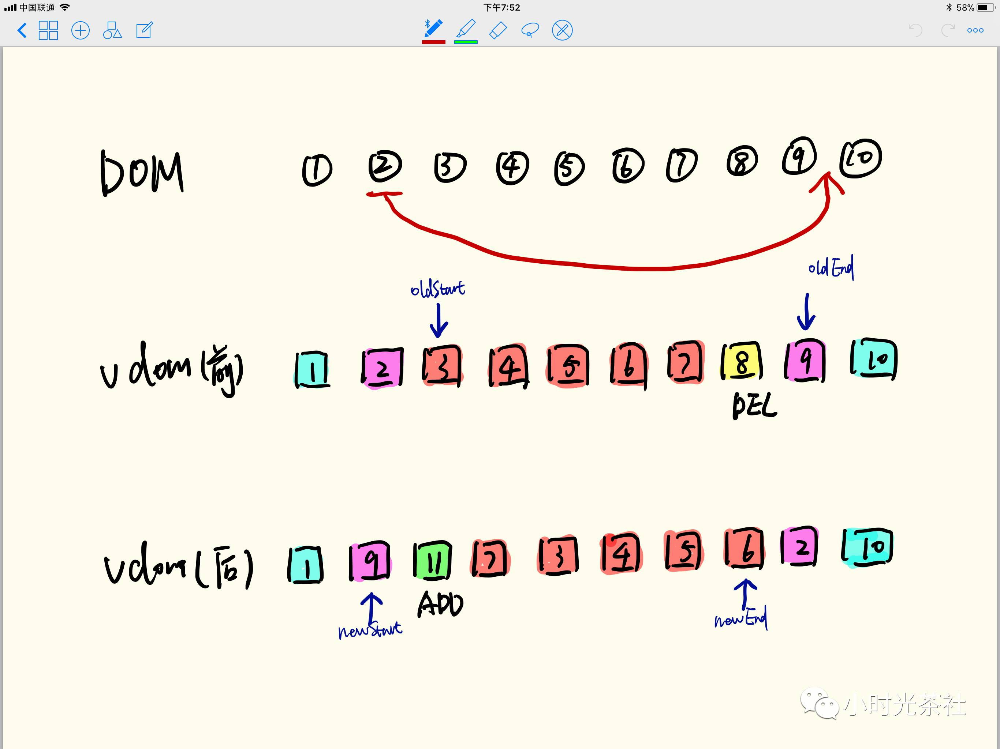
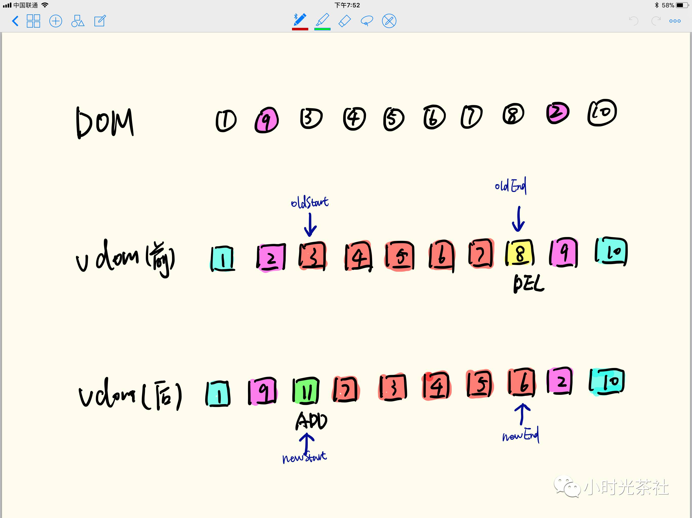
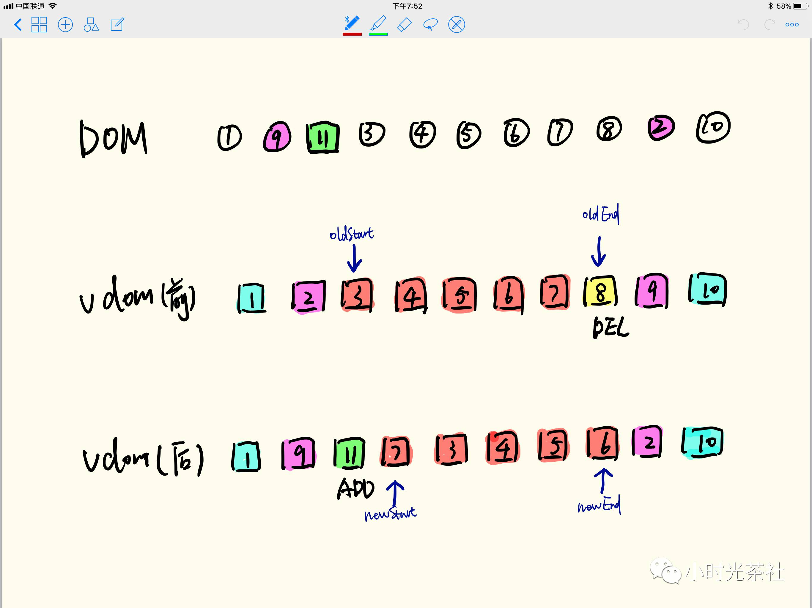
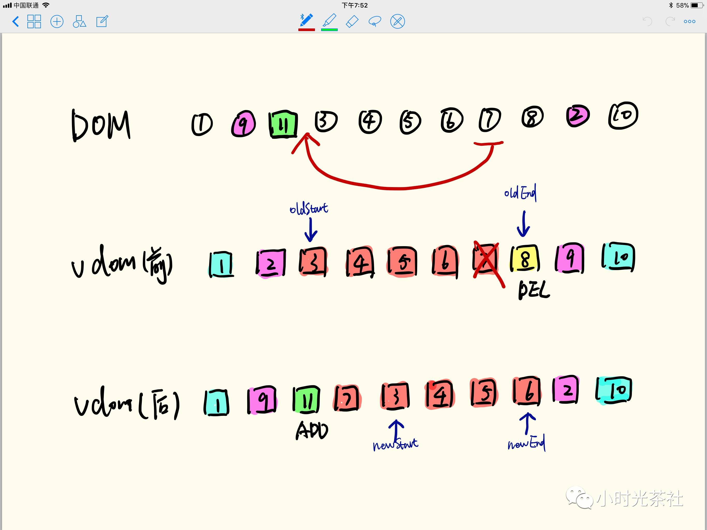
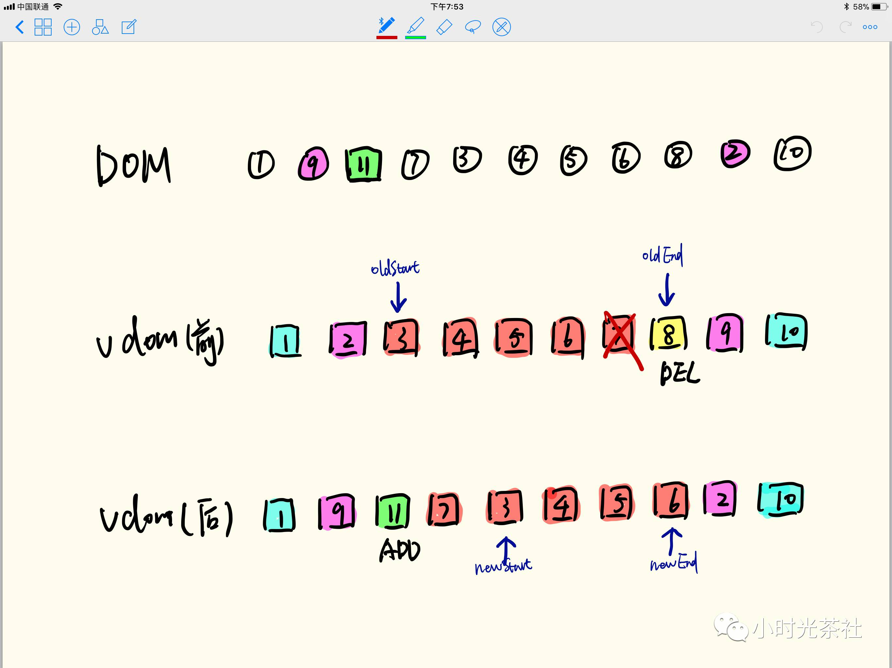
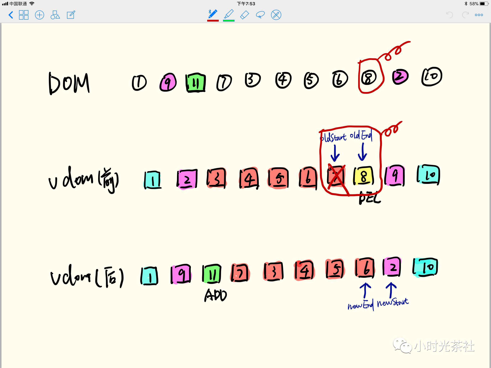

<!--
 * @Author: tangdaoyong
 * @Date: 2021-02-18 11:28:47
 * @LastEditors: tangdaoyong
 * @LastEditTime: 2021-02-18 11:35:03
 * @Description: diff
-->
<!-- TOC -->

- [Vue diff 算法](#vue-diff-算法)
    - [介绍](#介绍)
    - [Vue diff](#vue-diff)
        - [diff 步骤](#diff-步骤)
            - [步骤1](#步骤1)
            - [步骤2](#步骤2)
            - [步骤3](#步骤3)
            - [步骤4](#步骤4)
            - [步骤5](#步骤5)
            - [步骤6](#步骤6)
            - [步骤7](#步骤7)
        - [Vue diff 和 React diff 区别](#vue-diff-和-react-diff-区别)

<!-- /TOC -->
# Vue diff 算法

[snabbdom github](https://github.com/snabbdom/snabbdom)

## 介绍

`Vue`的核心是**双向绑定**和**虚拟DOM**（下文我们简称为vdom），`vdom`是树状结构，其节点为`vnode`，`vnode`和浏览器`DOM`中的`Node`一一对应，通过`vnode`的`elm`属性可以访问到对应的`Node`。

`vdom`因为是纯粹的`JS`对象，所以操作它会很高效，但是`vdom`的变更最终会转换成`DOM`操作，为了实现高效的`DOM`操作，一套高效的虚拟`DOM diff`算法显得很有必要。

`Vue`的`diff`算法是基于[snabbdom](https://github.com/snabbdom/snabbdom)改造过来的，感兴趣的朋友可以选择查阅。

这是一张很经典的图，出自`《React’s diff algorithm》`，`Vue`的`diff`算法也同样，即仅在同级的`vnode`间做`diff`，递归地进行同级`vnode`的`diff`，最终实现整个`DOM`树的更新。

## Vue diff

`Vue diff`中使用`oldStart`、`oldEnd`和`newStart`、`newEnd`这样2对指针，分别对应`oldVdom`和`newVdom`的起点和终点。起止点之前的节点是待处理的节点，`Vue`不断对`vnode`进行处理同时移动指针直到其中任意一对起点和终点相遇。处理过的节点`Vue`会在`oldVdom`和`newVdom`中同时将它标记为已处理（标记方法后文中有介绍）。`Vue`通过以下措施来提升`diff`的性能。

1. 优先处理特殊场景

* 头部的同类型节点、尾部的同类型节点。这类节点更新前后位置没有发生变化，所以不用移动它们对应的DOM
* 头尾/尾头的同类型节点。这类节点位置很明确，不需要再花心思查找，直接移动`DOM`就好

2. 原地复用

**原地复用**是指`Vue`会尽可能复用`DOM`，尽可能不发生`DOM`的移动。`Vue`在判断更新前后指针是否指向同一个节点，其实不要求它们真实引用同一个`DOM`节点，实际上它仅判断指向的是否是同类节点（比如2个不同的`div`，在`DOM`上它们是不一样的，但是它们属于同类节点），如果是同类节点，那么`Vue`会直接复用`DOM`，这样的好处是不需要移动`DOM`。再看上面的实例，假如10个节点都是`div`，那么整个diff过程中就没有移动`DOM`的操作了。

### diff 步骤

如上图的例子，更新前是1到10排列的Node列表，更新后是乱序排列的Node列表。罗列一下图中有以下几种类型的节点变化情况：
1. 头部相同、尾部相同的节点：如1、10
2. 头尾相同的节点：如2、9（处理完头部相同、尾部相同节点之后）
3. 新增的节点：11
4. 删除的节点：8
5. 其他节点：3、4、5、6、7

整个`diff`分两部分：

1. 第一部分是一个循环，循环内部是一个分支逻辑，每次循环只会进入其中的一个分支，每次循环会处理一个节点，处理之后将节点标记为已处理（`oldVdom`和`newVdom`都要进行标记，如果节点只出现在其中某一个`vdom`中，则另一个`vdom`中不需要进行标记），标记的方法有2种，当节点正好在`vdom`的指针处，移动指针将它排除到未处理列表之外即可，否则就要采用其他方法，`Vue`的做法是将节点设置为`undefined`。

2. 循环结束之后，可能`newVdom`或者`oldVdom`中还有未处理的节点，如果是`newVdom`中有未处理节点，则这些节点是新增节点，做新增处理。如果是`oldVdom`中有这类节点，则这些是需要删除的节点，相应在`DOM`树中删除之

整个过程是逐步找到更新前后`vdom`的差异，然后将差异反应到`DOM`树上（也就是`patch`），特别要提一下`Vue`的`patch`是即时的，并不是打包所有修改最后一起操作`DOM`（`React`则是将更新放入队列后集中处理），朋友们会问这样做性能很差吧？实际上现代浏览器对这样的`DOM`操作做了优化，并无差别。

#### 步骤1

处理头部的同类型节点，即`oldStart`和`newStart`指向同类节点的情况，

这种情况下，将节点1的变更更新到`DOM`，然后对其进行标记，标记方法是`oldStart`和`newStart`后移1位即可，过程中不需要移动`DOM`（更新`DOM`或许是要的，比如属性变更了，文本内容变更了等等）

#### 步骤2

处理尾部的同类型节点，即`oldEnd`和`newEnd`指向同类节点的情况，如下图中的节点10

与情况（1）类似，这种情况下，将节点10的变更更新到`DOM`，然后`oldEnd`和`newEnd`前移1位进行标记，同样也不需要移动`DOM`

#### 步骤3

处理头尾/尾头的同类型节点，即`oldStart`和`newEnd`，以及`oldEnd`和`newStart`指向同类节点的情况，如下图中的节点2和节点9

先看节点2，其实是往后移了，移到哪里？移到`oldEnd`指向的节点（即节点9）后面，移动之后标记该节点，将`oldStart`后移1位，`newEnd`前移一位

操作结束之后情况如下图

同样地，节点9也是类似的处理，处理完之后如下

#### 步骤4

处理新增的节点。`newStart`来到了节点11的位置，在`oldVdom`中找不到节点11，说明它是新增的

那么就创建一个新的节点，插入`DOM`树，插到什么位置？插到`oldStart`指向的节点（即节点3）前面，然后将`newStart`后移1位标记为已处理（注意`oldVdom`中没有节点11，所以标记过程中它的指针不需要移动），处理之后如下图

#### 步骤5

处理更新的节点
经过第（4）步之后，`newStart`来到了节点7的位置，在`oldVdom`中能找到它而且不在指针位置（查找`oldVdom`中`oldStart`到`oldEnd`区间内的节点），说明它的位置移动了

那么需要在`DOM`树中移动它，移到哪里？移到`oldStart`指向的节点（即节点3）前面，与此同时将节点标记为已处理，跟前面几种情况有点不同，`newVdom`中该节点在指针下，可以移动`newStart`进行标记，而在`oldVdom`中该节点不在指针处，所以采用设置为`undefined`的方式来标记（一定要标记吗？后面会提到）

处理之后就成了下面这样

#### 步骤6

处理3、4、5、6节点

经过第（5）步处理之后，我们看到了令人欣慰的一幕，`newStart`和`oldStart`又指向了同一个节点（即都指向节点3），很简单，按照（1）中的做法只需移动指针即可，非常高效，3、4、5、6都如此处理，处理完之后如下图

#### 步骤7

处理需删除的节点

经过前6步处理之后（实际上前6步是循环进行的），朋友们看`newStart`跨过了`newEnd`，它们相遇啦！而这个时候，`oldStart`和`oldEnd`还没有相遇，说明这2个指针之间的节点（包括它们指向的节点，即上图中的节点7、节点8）是此次更新中被删掉的节点。

OK，那我们在`DOM`树中将它们删除， 再回到前面我们对节点7做了标记，为什么标记是必需的？标记的目的是告诉`Vue`它已经处理过了，是需要出现在新`DOM`中的节点，不要删除它，所以在这里只需删除节点8。

在应用中也可能会遇到`oldVdom`的起止点相遇了，但是`newVdom`的起止点没有相遇的情况，这个时候需要对`newVdom`中的未处理节点进行处理，这类节点属于更新中被加入的节点，需要将他们插入到`DOM`树中

### Vue diff 和 React diff 区别

1. `Vue`的`patch`是即时的，并不是打包所有修改最后一起操作`DOM``React`则是将更新放入队列后集中处理。
2. `Vue diff`使用了首尾指针，并优先处理了首尾指针的特殊情况，所以避免了`React diff`中特殊情况下，需要多次处理。如：`A,B,C,D`和`D,A,B,C`
3. `Vue diff`具有**原地复用**特性，减少了`DOM`移动。